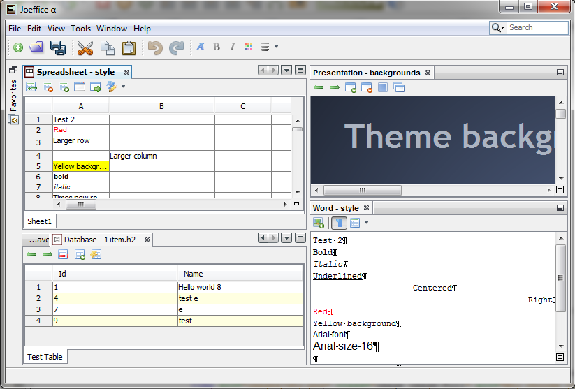

# Welcome to Joeffice - An Open Source Office Suite written in Java

Joeffice is released under the Apache License version 2.0

Joeffice modules and file extensions supported:
* Word Processor (docx)
* Spreadsheet (xlsx, xls, csv)
* Presentation (pptx)
* Drawing (svg)
* Database (h2)

Joeffice uses the following libraries:
* The NetBeans Platform (12.3) https://netbeans.org/features/platform/
* Apache POI (5.0.0) https://poi.apache.org/
* H2 Database (1.4.200) https://www.h2database.com/
* Batik (included in Apache POI) https://xmlgraphics.apache.org/batik/
* SwingX (1.6.5)
* JavaHelp (2.0)
* JUniversalCharDet (2.4.0) https://github.com/albfernandez/juniversalchardet

Software website (for users): 
https://www.joeffice.com/

Open source project page (for developer / contributors): 
https://www.joeffice.org/

What are the advantages compared to Microsoft Office:
* Free and Open Source
* Customize using the popular Java programming language
* Dark theme
* Window docking of documents in the application
* Can be included in your company Java applications (Apache License)

TODO
 * Recent files
 * Macro system (Edit -> Macro)
 * Fix actions
 * @ActionState
 * Fails on Java 16 (NetBeans framework exceptions thrown)

How to contribute:
 * There are a few FIXME in the code
 * Submit merge request
 * For large contributions, sign the contributor license agreement which stays that you and your company donate the code to this project.

For feature requests:
 * Contact info@japplis.com
